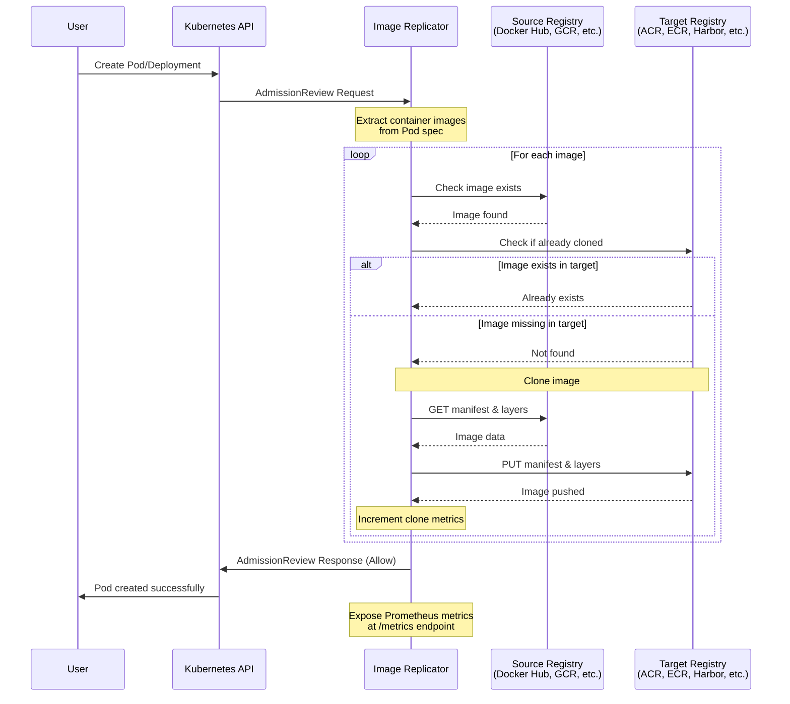

# Image Replicator

[](https://opensource.org/licenses/Apache-2.0)

A Kubernetes Validating Admission Webhook built with Bun that validates container images exist in registries and replicates them to a target registry before allowing pods to be created.

## Use Cases

### Development Cluster Image Tracking
Your dev cluster isn't air-gapped but you want to catch all images being deployed, even when hardcoded in system components like monitoring agents, CNI plugins, or operators. Image Replicator logs every image reference passing through the cluster, giving you a complete inventory.

### Air-Gapped Production Environments
Replicate all container images to your internal registry before pods can start. Perfect for secure environments where external registry access is blocked by firewall rules or network policies.

## Features

- **Image Existence Validation**: Verifies all container images exist in their registries before pods are scheduled
- **Multi-Registry Support**: Works with Docker Hub, GitHub Container Registry (GHCR), Google Container Registry (GCR), Amazon ECR, Azure ACR, and any OCI-compliant registry
- **Authentication**: Supports username/password and token-based authentication
- **Comprehensive Coverage**: Validates images in:
  - Pods
  - Deployments
  - StatefulSets
  - DaemonSets
  - ReplicaSets
  - Jobs
  - CronJobs
  - Init containers
  - Ephemeral containers

## Prerequisites

- Kubernetes cluster (1.19+)
- `kubectl` configured to access your cluster
- Docker (for building the image)
- Bun (for local development)

## Quick Start

### 1. Install Dependencies

```bash
bun install
```

### 2. Configure Registry Credentials

Edit `deploy/secret-credentials.yaml` with your registry credentials:

```yaml
apiVersion: v1
kind: Secret
metadata:
  name: registry-credentials
  namespace: image-replicator
type: Opaque
stringData:
  # Option 1: Docker config.json format
  DOCKER_CONFIG_JSON: |
    {
      "auths": {
        "docker.io": {
          "username": "your-username",
          "password": "your-password-or-token"
        },
        "ghcr.io": {
          "username": "your-github-username",
          "password": "your-github-pat"
        }
      }
    }
  
  # Option 2: Individual registry credentials
  REGISTRY_DOCKERHUB_URL: "docker.io"
  REGISTRY_DOCKERHUB_USERNAME: "your-username"
  REGISTRY_DOCKERHUB_PASSWORD: "your-password"
```

### 3. Deploy

There are two deployment options:

#### Option A: Using cert-manager (Recommended)

cert-manager handles TLS certificate generation and rotation automatically.

```bash
# Make scripts executable
chmod +x scripts/*.sh

# Deploy with cert-manager (will install cert-manager if not present)
./scripts/deploy-cert-manager.sh
```

#### Option B: Manual certificate management

```bash
# Make scripts executable
chmod +x scripts/*.sh

# Deploy to Kubernetes (generates self-signed certs)
./scripts/deploy.sh
```

### 4. Test

```bash
# This should be DENIED (image doesn't exist)
kubectl run test-invalid --image=this-image-does-not-exist:v999

# This should be ALLOWED (image exists)
kubectl run test-valid --image=nginx:latest
```

## Configuration

### Environment Variables

| Variable | Description | Default |
|----------|-------------|---------|
| `PORT` | Webhook HTTPS port | `8443` |
| `HEALTH_PORT` | Health check HTTP port | `8080` |
| `TLS_CERT_PATH` | Path to TLS certificate | `/certs/tls.crt` |
| `TLS_KEY_PATH` | Path to TLS private key | `/certs/tls.key` |
| `SKIP_TLS` | Disable TLS (development only) | `false` |

### Registry Authentication

#### Docker Config JSON Format

Set `DOCKER_CONFIG_JSON` environment variable:

```json
{
  "auths": {
    "registry.example.com": {
      "username": "user",
      "password": "pass"
    }
  }
}
```

#### Individual Registry Variables

```bash
REGISTRY_<NAME>_URL=registry.example.com
REGISTRY_<NAME>_USERNAME=user
REGISTRY_<NAME>_PASSWORD=pass
# or
REGISTRY_<NAME>_TOKEN=token
```

#### Default Credentials

Used when no specific registry match is found:

```bash
DEFAULT_REGISTRY_URL=docker.io
DEFAULT_REGISTRY_USERNAME=user
DEFAULT_REGISTRY_PASSWORD=pass
```

## How It Works



## Skipping Validation

To skip validation for specific resources, add the label:

```yaml
metadata:
  labels:
    image-replicator.io/skip: "true"
```

To skip validation for entire namespaces, the webhook is configured to ignore:
- `kube-system`
- `kube-public`
- `kube-node-lease`
- `image-replicator`

## Local Development

### Run Locally

```bash
# Generate development certificates
./scripts/generate-certs.sh

# Run with TLS
TLS_CERT_PATH=./certs/tls.crt TLS_KEY_PATH=./certs/tls.key bun run dev

# Run without TLS (development only)
SKIP_TLS=true bun run dev
```

### Test Webhook Locally

```bash
# Send a test admission review
curl -X POST https://localhost:8443/validate \
  -H "Content-Type: application/json" \
  -k \
  -d '{
    "apiVersion": "admission.k8s.io/v1",
    "kind": "AdmissionReview",
    "request": {
      "uid": "test-123",
      "kind": {"group": "", "version": "v1", "kind": "Pod"},
      "resource": {"group": "", "version": "v1", "resource": "pods"},
      "requestKind": {"group": "", "version": "v1", "kind": "Pod"},
      "requestResource": {"group": "", "version": "v1", "resource": "pods"},
      "namespace": "default",
      "operation": "CREATE",
      "userInfo": {"username": "admin", "uid": "1", "groups": []},
      "object": {
        "apiVersion": "v1",
        "kind": "Pod",
        "metadata": {"name": "test-pod"},
        "spec": {
          "containers": [
            {"name": "nginx", "image": "nginx:latest"}
          ]
        }
      },
      "dryRun": false
    }
  }'
```

## Architecture

```
┌─────────────────────────────────────────────────────────────┐
│                    Kubernetes API Server                     │
└─────────────────────────────────────────────────────────────┘
                              │
                              │ AdmissionReview
                              ▼
┌─────────────────────────────────────────────────────────────┐
│                  ValidatingWebhookConfiguration              │
│                                                              │
│  Rules:                                                      │
│  - Pods, Deployments, Jobs, CronJobs, etc.                  │
│  - CREATE and UPDATE operations                              │
└─────────────────────────────────────────────────────────────┘
                              │
                              │ HTTPS POST /validate
                              ▼
┌─────────────────────────────────────────────────────────────┐
│                Image Validator Webhook (Bun)                 │
│                                                              │
│  1. Extract images from object spec                          │
│  2. For each image:                                          │
│     - Parse registry, repository, tag                        │
│     - Authenticate with registry                             │
│     - Check if manifest exists                               │
│  3. Return allow/deny response                               │
└─────────────────────────────────────────────────────────────┘
                              │
                              │ Registry API v2
                              ▼
┌─────────────────────────────────────────────────────────────┐
│               Container Registries                           │
│                                                              │
│  Docker Hub │ GHCR │ GCR │ ECR │ ACR │ Custom               │
└─────────────────────────────────────────────────────────────┘
```

## Files Structure

```
.
├── src/
│   ├── index.ts              # Main entry point, webhook server
│   ├── types/
│   │   ├── index.ts
│   │   ├── kubernetes.ts     # Kubernetes type definitions
│   │   └── registry.ts       # Registry type definitions
│   ├── services/
│   │   ├── index.ts
│   │   └── registry-client.ts # Registry API client
│   ├── handlers/
│   │   ├── index.ts
│   │   └── admission.ts      # Admission review handler
│   └── utils/
│       ├── index.ts
│       ├── image-parser.ts   # Image reference parser
│       └── credentials.ts    # Credential loading
├── deploy/
│   ├── namespace.yaml
│   ├── deployment.yaml
│   ├── secret-credentials.yaml
│   ├── webhook-config.yaml
│   └── cert-manager/         # cert-manager based deployment
│       ├── kustomization.yaml
│       ├── issuer.yaml       # CA issuer configuration
│       ├── certificate.yaml  # Webhook TLS certificate
│       └── webhook-config.yaml # Webhook config with CA injection
├── scripts/
│   ├── generate-certs.sh     # Manual TLS certificate generation
│   ├── deploy.sh             # Manual deployment script
│   └── deploy-cert-manager.sh # cert-manager deployment script
├── Dockerfile
├── package.json
├── tsconfig.json
└── README.md
```

## Troubleshooting

### Webhook Not Receiving Requests

1. Check webhook configuration:
   ```bash
   kubectl get validatingwebhookconfigurations image-replicator -o yaml
   ```

2. Verify CA bundle is set correctly

3. Check webhook pod logs:
   ```bash
   kubectl logs -l app=image-replicator -n image-replicator -f
   ```

### Authentication Failures

1. Verify credentials are correctly set in the secret
2. Check if the registry requires specific authentication (e.g., GCR needs `_json_key` as username)
3. Test credentials manually:
   ```bash
   docker login registry.example.com
   ```

### Certificate Issues

#### With cert-manager

1. Check certificate status:
   ```bash
   kubectl get certificate -n image-replicator
   kubectl describe certificate image-replicator-cert -n image-replicator
   ```

2. Check if CA bundle was injected:
   ```bash
   kubectl get validatingwebhookconfiguration image-replicator -o jsonpath='{.webhooks[0].clientConfig.caBundle}' | base64 -d
   ```

3. Check cert-manager logs:
   ```bash
   kubectl logs -l app=cert-manager -n cert-manager
   kubectl logs -l app=cainjector -n cert-manager
   ```

4. Force certificate renewal:
   ```bash
   kubectl delete certificate image-replicator-cert -n image-replicator
   kubectl apply -k deploy/cert-manager
   ```

#### With manual certificates

1. Regenerate certificates:
   ```bash
   ./scripts/generate-certs.sh
   ```

2. Update the webhook configuration with new CA bundle

3. Restart webhook pods:
   ```bash
   kubectl rollout restart deployment/image-replicator -n image-replicator
   ```

## 🤝 Contributing

We welcome contributions! Please see [CONTRIBUTING.md](CONTRIBUTING.md) for guidelines.

### Quick Start for Contributors

```bash
# Fork and clone
git clone https://github.com/YOUR_USERNAME/image-replicator.git
cd image-replicator

# Install dependencies
bun install

# Run tests
bun test

# Type check
bun run type-check

# Make your changes and submit a PR
```

## 📜 Code of Conduct

This project follows the [Contributor Covenant Code of Conduct](CODE_OF_CONDUCT.md). By participating, you are expected to uphold this code.

## 🔒 Security

See [SECURITY.md](SECURITY.md) for our security policy and how to report vulnerabilities.

## 🙏 Acknowledgments

- Built with [Bun](https://bun.sh/) for high performance
- Inspired by Kubernetes best practices and CNCF projects
- Thanks to all [contributors](https://github.com/svitio-company/image-replicator/graphs/contributors)

## License

This project is licensed under the Apache License 2.0 - see the [LICENSE](LICENSE) file for details.

```
Copyright 2025 Martin Slanina

Licensed under the Apache License, Version 2.0 (the "License");
you may not use this file except in compliance with the License.
You may obtain a copy of the License at

    http://www.apache.org/licenses/LICENSE-2.0

Unless required by applicable law or agreed to in writing, software
distributed under the License is distributed on an "AS IS" BASIS,
WITHOUT WARRANTIES OR CONDITIONS OF ANY KIND, either express or implied.
See the License for the specific language governing permissions and
limitations under the License.
```
